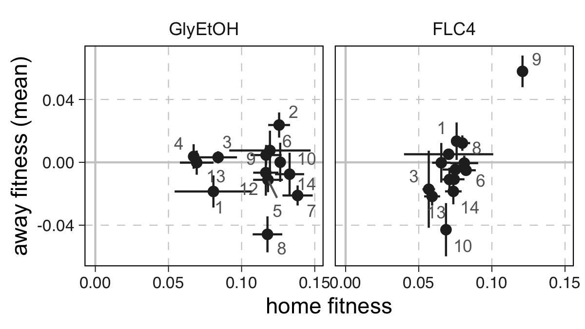
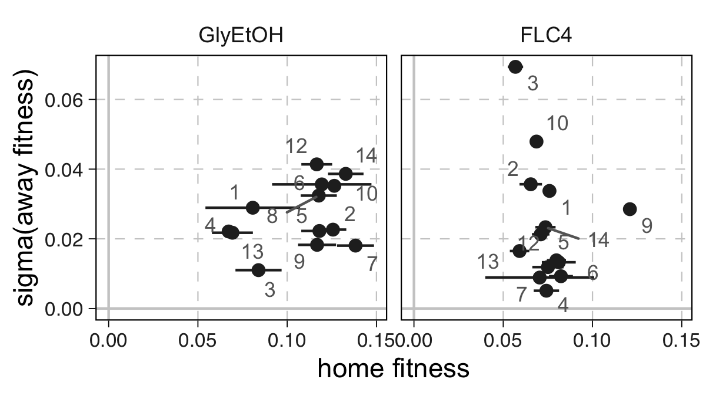
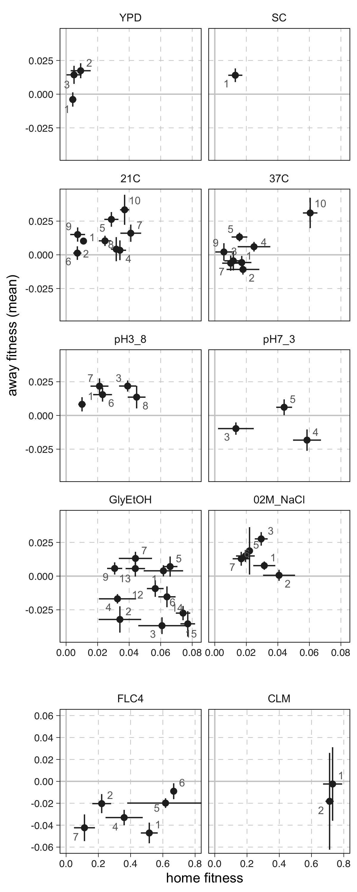
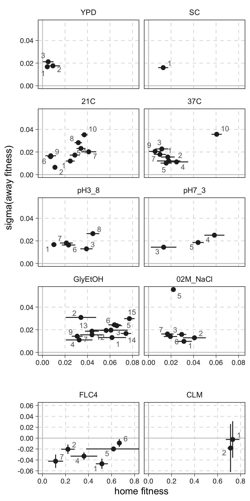

# Home v away comparisons

Plots below represent the weighted mean fitness in the home environment ($\pm$ weighted standard error) of the barcodes per cluster from the indicated source environment along the $x$ axis, versus, for each ploidy separately:

1. the weighted mean ($\pm$ weighted standard error) of fitness change in the away environments along the $y$-axis (top panel)
2. the weighted standard deviation in fitness change in the away environments along the $y$-axis (lower panel).

## 1N plots, by cluster

    
    <figcaption>
        <strong>
            Haploid $s_{\text{home}}$ versus $\mu(s_{\text{away}})$
        </strong>
    </figcaption>

    
    <figcaption>
        <strong>
            Haploid $s_{\text{home}}$ versus $\sigma(s_{\text{away}})$
        </strong>
    </figcaption>

## 2N plots, by cluster

    
    <figcaption>
        <strong>
            Diploid $s_{\text{home}}$ versus $\mu(s_{\text{away}})$
        </strong>
    </figcaption>

    
    <figcaption>
        <strong>
            Diploid $s_{\text{home}}$ versus $\mu(s_{\text{away}})$
        </strong>
    </figcaption>

