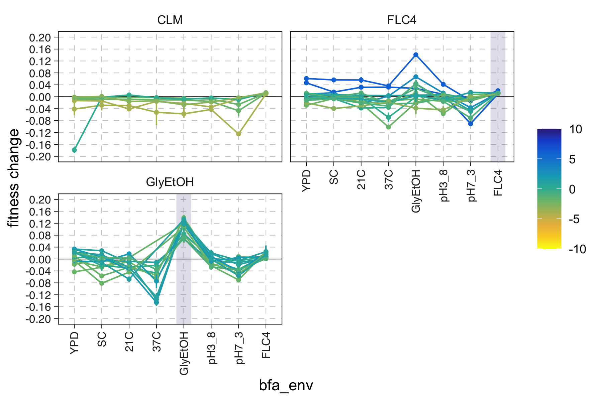
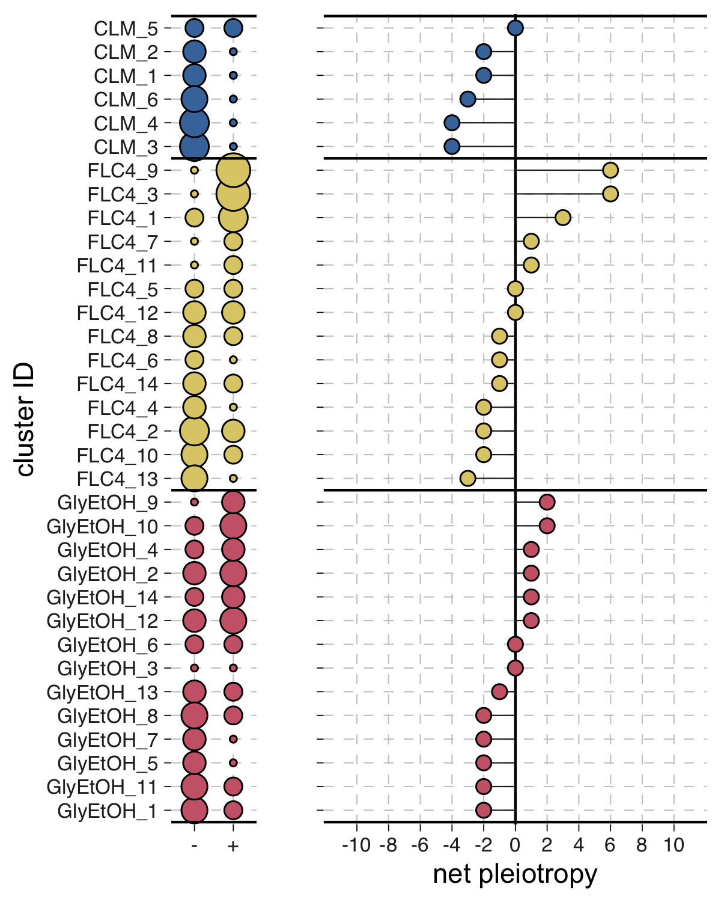
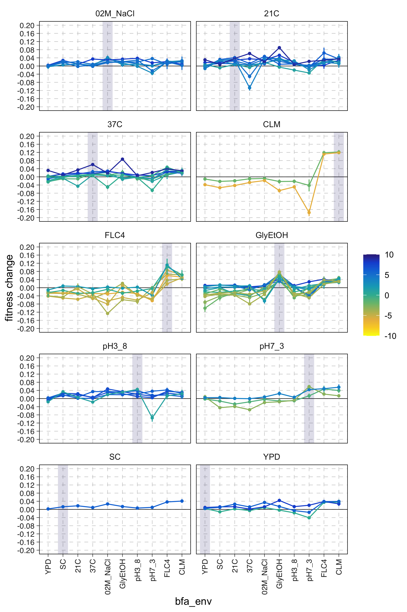
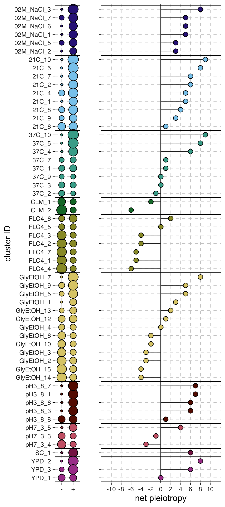

# Cluster-level

## 1N plots

### Fitness traces by cluster

    
    <figcaption>
        <!--<strong>Diploid lineage summary.</strong>-->
    </figcaption>

### Pleiotropic effects by cluster

    
    <figcaption>
        <!--<strong>Diploid lineage summary.</strong>-->
    </figcaption>

## 2N plots

### Fitness traces by cluster

    
    <figcaption>
        <!--<strong>Diploid lineage summary.</strong>-->
    </figcaption>

### Pleiotropic effects by cluster

    
    <figcaption>
        <!--<strong>Diploid lineage summary.</strong>-->
    </figcaption>

### Pairwise distances between clusters

    
    <figcaption>
        <!--<strong>Diploid lineage summary.</strong>-->
    </figcaption>

