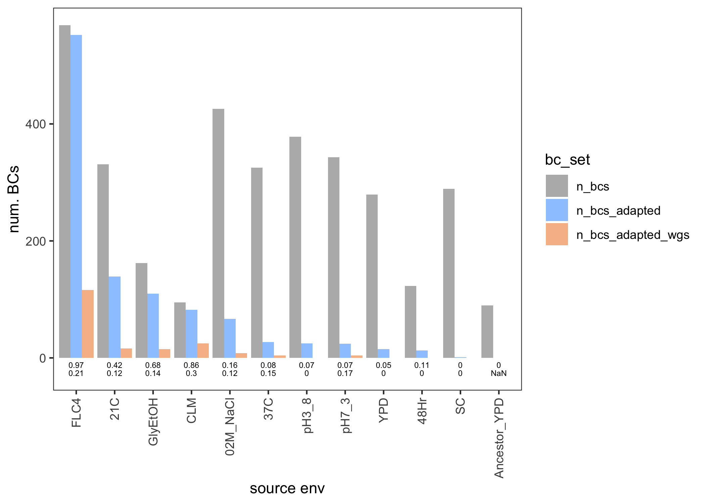

# Summary of adapted lineages by ploidy

## Plots

### 1N lineage summary

    
    <figcaption>
        <!--<strong>Haploid lineage summary.</strong>-->
    </figcaption>

### 2N lineage summary

    
    <figcaption>
        <!--<strong>Diploid lineage summary.</strong>-->
    </figcaption>

## Tables

### 1N lineage summary

| source  | n_bcs | n_bcs_adapted | p_bcs_adapted | n_wgs | p_wgs | n_bcs_adapted_wgs | p_adapted_w_wgs | n_clusters |
| :------ | :---- | :------------ | :------------ | :---- | :---- | :---------------- | :-------------- | :--------- |
| GlyEtOH | 124   | 70            | 0.56          | 47    | 0.38  | 31                | 0.44            | 14         |
| CLM     | 67    | 63            | 0.94          | 39    | 0.58  | 36                | 0.57            | 7          |
| pH7_3   | 143   | 62            | 0.43          | 0     | 0     | 0                 | 0               | 2          |
| FLC4    | 82    | 61            | 0.74          | 32    | 0.39  | 25                | 0.41            | 15         |
| SC      | 261   | 6             | 0.02          | 0     | 0     | 0                 | 0               | 6          |
| YPD     | 232   | 5             | 0.02          | 1     | 0     | 0                 | 0               | 3          |
| 21C     | 301   | 2             | 0.01          | 1     | 0     | 0                 | 0               | 3          |
| 37C     | 119   | 0             | 0             | 0     | 0     | 0                 | NaN             | 1          |
| pH3_8   | 128   | 0             | 0             | 1     | 0.01  | 0                 | NaN             | 1          |

### 2N lineage summary

| source       | n_bcs | n_bcs_adapted | p_bcs_adapted | n_wgs | p_wgs | n_bcs_adapted_wgs | p_adapted_w_wgs | n_clusters |
| :----------- | :---- | :------------ | :------------ | :---- | :---- | :---------------- | :-------------- | :--------- |
| FLC4         | 569   | 552           | 0.97          | 118   | 0.21  | 116               | 0.21            | 8          |
| 21C          | 331   | 139           | 0.42          | 18    | 0.05  | 16                | 0.12            | 10         |
| GlyEtOH      | 162   | 110           | 0.68          | 18    | 0.11  | 15                | 0.14            | 14         |
| CLM          | 95    | 82            | 0.86          | 29    | 0.31  | 25                | 0.3             | 3          |
| 02M_NaCl     | 426   | 67            | 0.16          | 16    | 0.04  | 8                 | 0.12            | 7          |
| 37C          | 325   | 27            | 0.08          | 14    | 0.04  | 4                 | 0.15            | 9          |
| pH3_8        | 378   | 25            | 0.07          | 0     | 0     | 0                 | 0               | 6          |
| pH7_3        | 343   | 24            | 0.07          | 6     | 0.02  | 4                 | 0.17            | 4          |
| YPD          | 279   | 15            | 0.05          | 0     | 0     | 0                 | 0               | 4          |
| 48Hr         | 123   | 13            | 0.11          | 0     | 0     | 0                 | 0               | 7          |
| SC           | 289   | 1             | 0             | 1     | 0     | 0                 | 0               | 2          |
| Ancestor_YPD | 90    | 0             | 0             | 1     | 0.01  | 0                 | NaN             | 1          |

